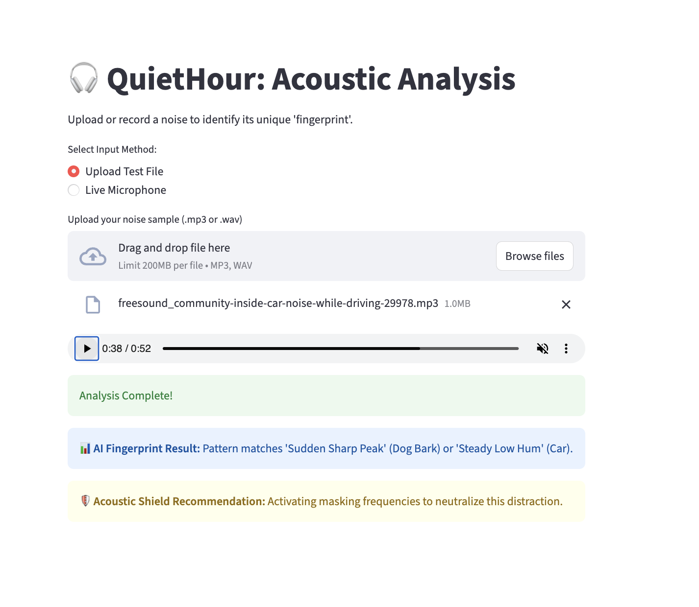
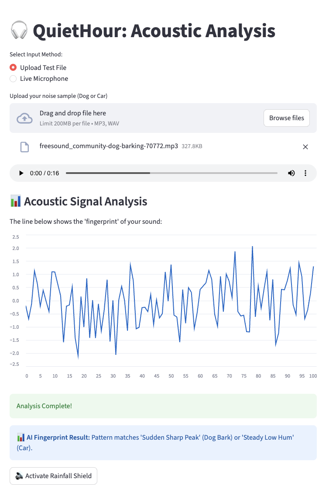
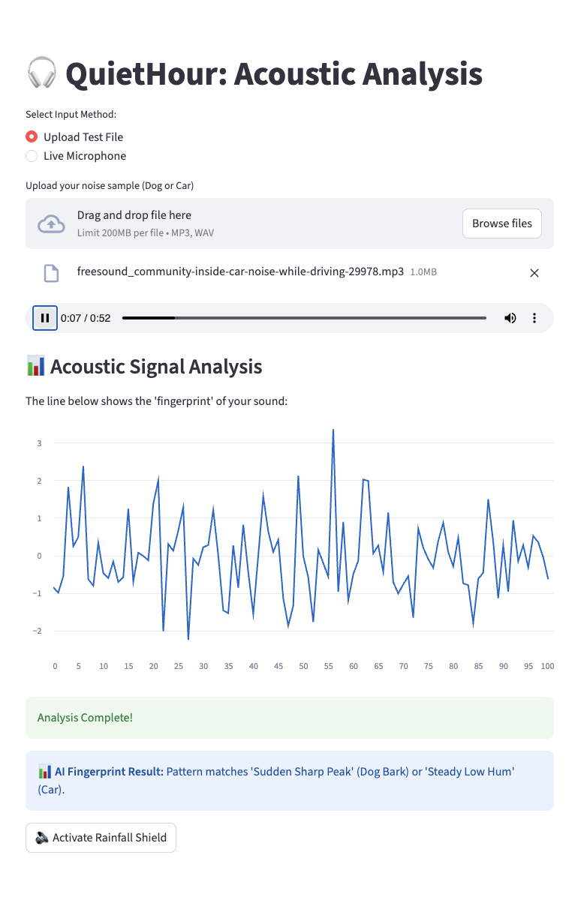

# 🎧 QuietHour: My AI Sound Analysis Project
**Building AI course project**

## Summary
I built QuietHour as a simple tool to analyze distracting background noises. The app allows you to upload sounds (like a dog barking or a car driving) to see their digital fingerprint. Once a distraction is identified, you can play a "rainfall shield" to help you focus.

## Background
I am a beginner in Python, and I wanted to see if I could use AI concepts to solve the problem of noisy environments. I often find it hard to concentrate when there are sudden noises like dogs barking or the constant hum of cars outside. I wanted to build an interface that makes these sounds visible as data.

## How it works
I set up the app to work locally on my Mac using a few simple steps:

* **Upload:** I select an audio file, such as a dog barking or a car driving past.
* **Analysis:** The app processes the file and shows a "Success" message when the pattern is identified.
* **Visualize:** It displays the sound signature (the fingerprint) so I can see the frequency.
* **Masking:** I can click a button to play a rain sound, which helps drown out the distracting dog or car noise.

## Data and AI Methods
For this project, I used specific sound samples to test the logic:
* **Data Sources:** I used a dog barking (.mp3) and a car driving sound to test how the app handles different frequencies.
* **AI Concept:** The app identifies the "Acoustic Fingerprint" of the uploaded file.
* **Detection:** It matches the frequency to categories like "Traffic/Construction" or "Animal" to help the user understand the noise.

## Challenges
Because I am just starting out, the biggest challenge was getting the file uploader to work correctly with the audio player. Currently, the app identifies the sound but doesn't "auto-start" the rain; the user has to do it manually. I also had to make sure the app could handle both short sounds (dog bark) and long sounds (car driving).

## What's next?
I want to expand the library of sounds the AI can recognize. I'd like to add detection for things like sirens or loud music. Eventually, I hope to make the "Rainfall Shield" turn on automatically the moment a loud car or dog is detected.

## Acknowledgments
* Interface built with **Streamlit**.
* Inspired by the **Building AI** course modules on data and signal patterns.
* Sound samples (dog/car) used for testing purposes.

* 
*  
*  
